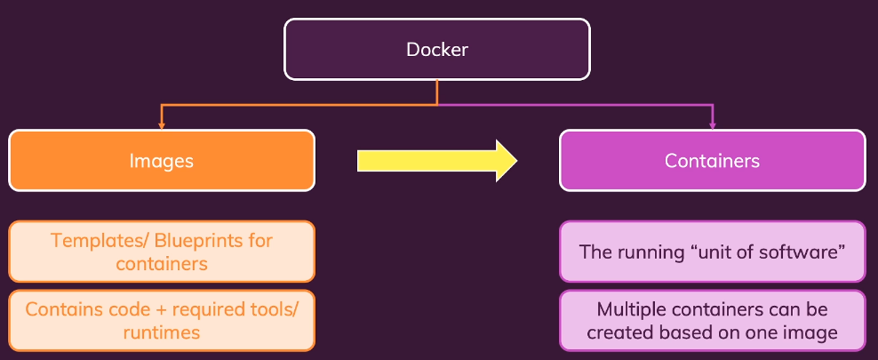
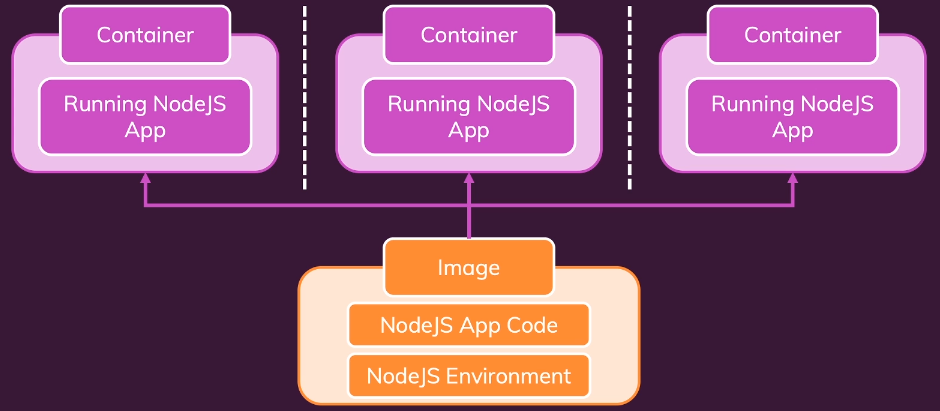
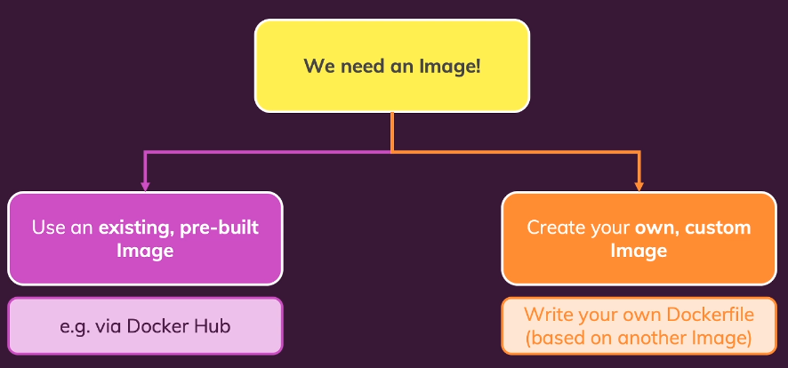

# practical-docker-kubernetes
## Getting Started
### first-demo-starting-setup
Runs simple node.js Server. Go into folder and type:
```
docker build .
```
builds image. Grab the id of the image for the next step:
```
docker run -p 3000:3000 <ID>
```
Use a browser and visit: [http://localhost:3000](http://localhost:3000)

## Docker Images & Containers: The Core Building Blocks

 

 
Base images can be found at [https://hub.docker.com/](https://hub.docker.com/).

You can find the node image there.
To run it simply put:
```
docker run node
```
to create a container by the image.

**Useful commands**:  
`docker ps` to get all running containers. with `-a` to get all containers including stopped ones.  
`docker run -it <container>`to get a console inside the running container.

### NodeJS App
Build my own custom image.

